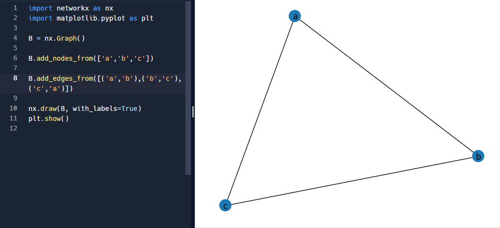
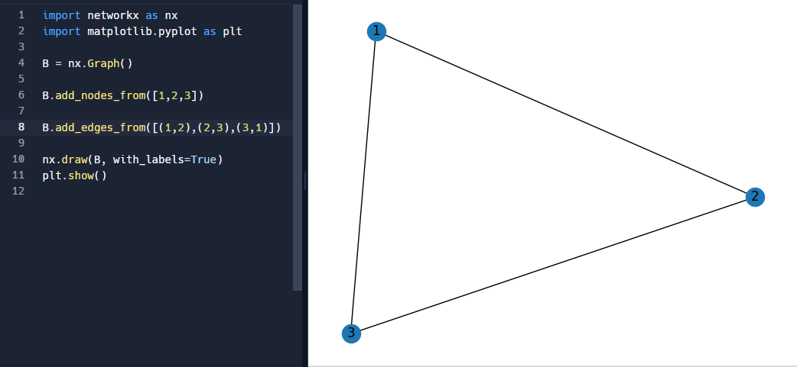

1. Define:

	(a) Subgraph  
	  
	Subgrafo é o grafo adjacente de um outro grafo, ou um grafo cujo conjunto de vértices é subconjunto de outro grafo. 
	
	(b) Bipartite graph  
	  
	Grafos que podem ser divididos em outros dois grafos que atuam de maneira independente, mas as arestas conectam-se aos vertices de cada um.
		
	(c) Hamiltonian graph  
	  
	É o grafo que permite se passar por todos os vértices uma vez sem precisar repeti-los, esse ciclo envolvendo os vértices é chamado de ciclo hamiltoniano.
	
	(d) Eulerian graph  
	
	Grafo Euleriano passa por todas as arestas uma única vez, sem repetir. No circuito Euleriano o caminho começa e termina no mesmo vértice.

2. Describe how a breadth-first search algorithm works.
    
	O algoritmo de busca em amplitude é um algoritmo de busca em grafos ou estruturas em tipo árvore, ela parte de um vértice inicial (raiz) e realiza a busca em cada vértice vizinho, e se esses tiverem vizinhos pesquisa neles e assim por diante até encontrar o resultado esperado. 

3. How many edges does a complete graph with n vertices have? What about a complete directed graph with n vertices?
	  
	  Um grafo geralmente contem a sua quantidade de arestas no calculo de n*(n-1)/2, sendo n o número de vértices.
	  Já um grafo direcionado, a quantidade de arestas é calculada pelos graus de entrada e saída de cada vértice.
	  
4. What are isomorphic graphs? Draw an example.
  
  	Grafos isomórficos são dois grafos onde ocorre a mesma estrutura, ou seja, eles tem o mesmo número vértices e arestas e os vértices são conectados da mesma maneira.
	  	
	
 
		 
		 
	

	
5. Calculate the degree of the nodes for both node types in the bipartite adjacency matrix from the figure below. Find the isolated node(s).

  
  Para calcular o grau das matrizes de adjacencia bipartidas, assumimos que a sua dimensão é de |V1|x|V2|.
    
  Onde as linhas correspondem a nós em V1 e colunas a nós em V2, e o valor na matriz é 1 caso a aresta conecte os nós v1 a v2 e 0 caso não conecte.
    
  Dito isso o calculo é feito da soma da linha que corresponde ao nó no caso de v1 e da coluna no caso do v2.
    
  Assim, para esse calculo utilizei uma das bibliotecas e a função correspondente em python inserindo a tabela acima, ficando:
    
    import numpy as np

	# Matriz de adjacência bipartida
	matriz_adjacente = np.array([[0, 0, 1, 0, 0, 0, 0, 0, 1],
                             [0, 0, 0, 0, 0, 1, 1, 1, 0],
                             [0, 0, 0, 1, 1, 1, 1, 0, 0],
                             [0, 0, 0, 0, 0, 0, 1, 0, 1],
                             [1, 1, 0, 0, 0, 0, 0, 0, 1],
                             [0, 0, 1, 0, 0, 0, 0, 0, 0],
                             [0, 0, 0, 0, 0, 0, 0, 0, 0],
                             [0, 1, 1, 0, 0, 0, 0, 0, 0],
                             [0, 0, 0, 0, 0, 0, 1, 0, 0]])

	# Grau dos nós em V1
	v1 = np.sum(matriz_adjacente, axis=1)
	print("Grau dos nós em V1:", v1)

	# Grau dos nós em V2
	v2 = np.sum(matriz_adjacente, axis=0)
	print("Grau dos nós em V2:", v2)
	
  	
  	
O resultado, o qual conferi manualmente, foi: 
  
 	Grau dos nós em V1: [2 3 4 2 3 1 0 2 1]
 	Grau dos nós em V2: [1 2 3 1 1 2 4 1 3]
  
Já os nós isolados não existem em V2, já que todas as colunas tem pelo menos 1 aresta conectando os nós, porém em V1 verificamos a existencia de uma linha vazia no nó 7!

6. Given the digraph `G = (V, E)` where `V = {M, N, O, P, Q, R, S}` and 

`E ={(M, S), (N, O), (P, R), (N, S), (O, M),
	 (N, Q), (O, M), (P, P), (S, M), (O, N), 
	 (S, M), (N, R), (P, M), (M, S)}`

	(a) Specify, if any, a simple path from vertex M to vertex S.

	(b) Specify, if any, a simple cycle, involving at least 4 nodes.

	(c) Is the digraph connected or not connected?

	(d) What is the degree of vertices N and R.

	(e) Represent the digraph using adjacency list representation.

	(f) Represent the digraph using adjacency matrix representation.
	

  
  Realizei a representação do digrafo em python utilizando a biblioteca networkx e matplotlib.pyplot, resultando em: 
    
    import networkx as nx
    import matplotlib.pyplot as plt

	G = nx.DiGraph()
	G = nx.DiGraph()
	G.add_nodes_from(['M', 'N', 'O', 'P', 'Q', 'R', 'S'])
	G.add_edges_from([('M', 'S'), ('N', 'O'), ('P', 'R'), 
                  	  ('N', 'S'), ('O', 'M'), ('N', 'Q'), 
                  	  ('O', 'M'), ('P', 'P'), ('S', 'M'), 
                  	  ('O', 'N'), ('S', 'M'), ('N', 'R'), 
                  	  ('P', 'M'), ('M', 'S')])

	nx.draw(G, with_labels=True)
	plt.show()

Resultando em: 

	
7. Draw the undirected and directed versions of the graph G(V, E), where V = {1, 2, 3, 4, 5, 6} and E = {(2, 5), (6, 1), (5, 3), (2, 3)}.

8. How many edges does a graph have 3 vertices of degree 3 and one vertex of degree 5?

9. Mr. A is friend with Mrs. B, but she doesn't like him back. She has a reciprocal friendship with both C and D, but only C considers D a friend. D has also sent friend requests to E, F, G, and H but, so far, only G replied. G also has a reciprocal relationship with A. Draw the corresponding directed graph.

10. Draw the graph from the previous exercise as undirected and weighted, with the weight being 2 if the connection is reciprocal, 1 otherwise.
